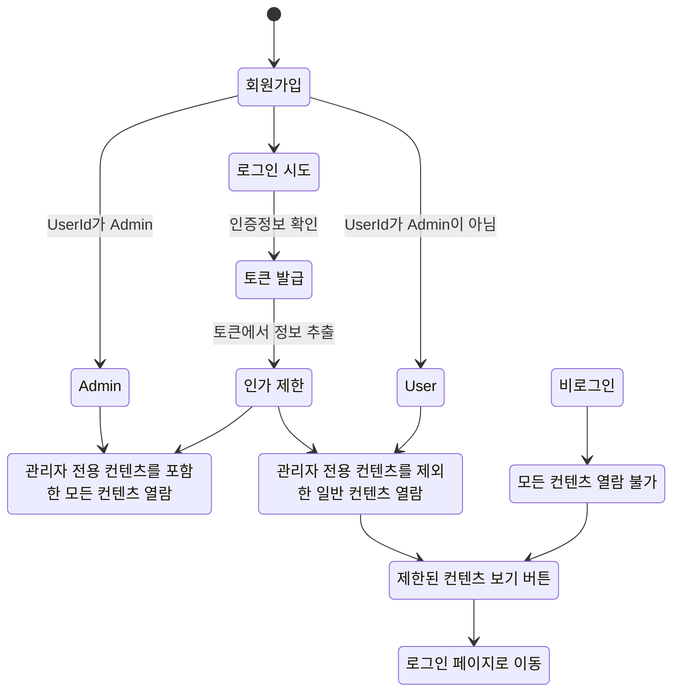

# SpringBoot-Security-Park Kyung Hoon
---
## 인증/인가 Security
  + **JWT 토큰**을 이용한 **인증**
  + 사용자 **역할**에 따라 **인가** ( ADMIN, USER )
---
## 📌 목차
[1. 주요 기능](#-주요-기능)

[2. 플로우 차트](#-플로우-차트)

[3. 인증 흐름](#-인증-흐름)

[4. 인가 흐름](#-인가-흐름)

---
## 💡 주요 기능
+ **JWT 토큰**
  1. 로그인 시 현재 시간을 가져와 만료 시간을 계산하여 토큰의 만료 시간을 설정
  2. 토큰이 유효한지, 만료되었는지, 잘못된 토큰인지 검증
     + 토큰이 만료되었다면 `Refresh-Token`을 이용해 토큰 재발급
     + `Refresh-Token` 마저 만료되었다면 `LocalStorage`에 저장된 `Refresh-Token`와 `Access-Token` 을 삭제하고 재로그인 요청
  3. 유효한 토큰이라면 해당 토큰을 기반으로 하여 사용자 정보 조회

+ **Role에 따른 인가**
  1. 회원가입시 `User_id`가 `ADMIN`일 경우에만 role이 `ROLE_ADMIN`으로 설정, 이외에는 기본적으로 전부 `ROLE_USER`
  2. 메인 페이지에서 `admin-content`와 `member-content`로 구분하여 토큰으로 조회한 `Role`이 `ROLE_ADMIN`인 관리자 계정만 모두 열람 가능
  3. `Role`이 `ROLE_USER`인 사용자의 경우 제한된 콘텐츠 열람 시도할시 액세스 거부
---
## 🗂 플로우 차트

---
## 🔐 인증 흐름

---
## 🔑 인가 흐름

---
