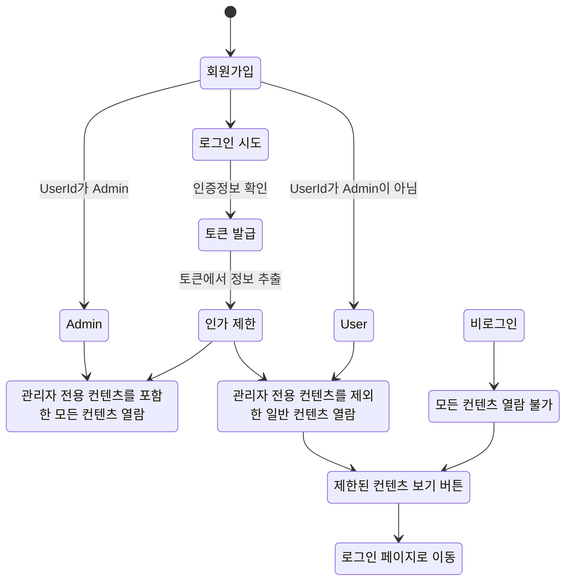

# SpringBoot-Security-Park Kyung Hoon
---
## 인증/인가 Security
  + **JWT 토큰**을 이용한 **인증**
  + 사용자 **역할**에 따라 **인가** ( ADMIN, USER )
---
## 📌 목차
[1. 주요 기능](#-주요-기능)

[2. 플로우 차트](#-플로우-차트)

[3. 인증 흐름](#-인증-흐름)

[4. 인가 흐름](#-인가-흐름)

---
## 💡 주요 기능
+ **JWT 토큰**
  1. 로그인 시 현재 시간을 가져와 만료 시간을 계산하여 토큰의 만료 시간을 설정
  2. 토큰이 유효한지, 만료되었는지, 잘못된 토큰인지 검증
     + 토큰이 만료되었다면 `Refresh-Token`을 이용해 토큰 재발급
     + `Refresh-Token` 마저 만료되었다면 `LocalStorage`에 저장된 `Refresh-Token`와 `Access-Token` 을 삭제하고 재로그인 요청
  3. 유효한 토큰이라면 해당 토큰을 기반으로 하여 사용자 정보 조회

+ **Role에 따른 인가**
  1. 회원가입시 `User_id`가 `ADMIN`일 경우에만 role이 `ROLE_ADMIN`으로 설정, 이외에는 기본적으로 전부 `ROLE_USER`
  2. 메인 페이지에서 `admin-content`와 `member-content`로 구분하여 토큰으로 조회한 `Role`이 `ROLE_ADMIN`인 관리자 계정만 모두 열람 가능
  3. `Role`이 `ROLE_USER`인 사용자의 경우 제한된 콘텐츠 열람 시도할시 액세스 거부
---
## 🗂 플로우 차트

---
## 🔐 인증 흐름

### 1. 메인 페이지에서 접속시 비로그인 상태에서 일반 사용자 콘텐츠의 리스트만 보여집니다.

### 2. 일반 사용자 콘텐츠와 제한된 컨텐츠 보기 클릭시 로그인이 필요하다는 알림이 뜨고 로그인 페이지로 전환됩니다.

### 2-1. 가입된 아이디가 있다면 로그인을 진행합니다.

### 2-2. 가입된 아이디가 없다면 회원가입 버튼을 누르고 회원가입을 진행합니다.

---
## 🔑 인가 흐름
  1. 로그인 시 `JWT` 토큰이 발급되고 **토큰에 담긴 사용자에 정보**를 참고하여 페이지에 노출시킵니다.
  2. 토큰에 담긴 사용자의 `Role`에 따라 **페이지 접근 인가**가 달라집니다.
  3. `Role`이 `User`인 **일반적인 사용자**의 경우 **허용된 범위 내의 콘텐츠만 열람이 가능**하고 **권한이 없는 콘텐츠 접근 시도시 거부**됩니다.
  4. `Role`이 `Admin`인 **관리자**의 경우 **모든 콘텐츠가 열람이 가능**합니다.

### 1. 일반적으로 회원가입후 로그인시 일반 사용자의 이름이 노출되고 일반 사용자 콘텐츠 클릭시 열람이 가능합니다.

### 2-1. 제한된 컨텐츠 보기 클릭시 관리자만 접근할 수 있는 콘텐츠라는 알림이 뜬 후

### 2-2. 접근할 수 없는 페이지를 알리는 페이지로 이동됩니다.

### 3. 회원가입시 Admin 이라는 아이디로 가입한 관리자 계정의 경우 일반 사용자 콘텐츠 및 관리자 콘텐츠 전부 열람 가능합니다.

---

  
[목차로](#-목차)

